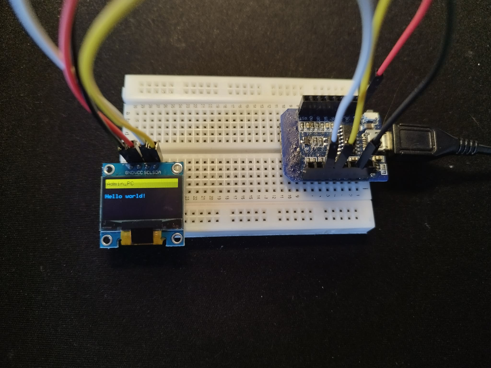

# Kubernetes IoT WebSocket Bridge


Wersja polska poniżej
A real-time communication system bridging a web browser and an ESP8266 microcontroller, running inside a local Kubernetes cluster. Built to explore cross-VLAN routing and container orchestration in a HomeLab environment.

## The Challenge: Network Isolation and Security

The core of this project focused on networking architecture and security. IoT devices are managed with the following constraints:
1. VLAN Segmentation: The Wemos D1 Mini operates in a dedicated, isolated VLAN (samba-iot) on a ZTE MF286D router running OpenWrt.
2. Firewall Policy: The firewall blocks all traffic from the IoT zone to the LAN by default.
3. Targeted Routing: Specific firewall traffic rules were configured to permit only TCP packets targeting port 30000 (NodePort) on the Kali Linux node where the K3s cluster resides.

## System Components

### Kubernetes (K3s) and Docker
* Backend: Python-based server using websockets and asyncio for handling concurrent connections.
* Deployment: YAML manifests manage the pod lifecycle and expose the application via NodePort 30000.
* Image Management: Built with Docker, then manually imported into the containerd runtime of the K3s cluster.

### Hardware (Wemos D1 Mini)
* OLED Display: I2C-connected SSD1306 screen for real-time network telemetry and message preview.
* JSON Processing: Implementation of ArduinoJson for structured data exchange.
* Resilience: Auto-reconnect logic to ensure session recovery after server restarts or network timeouts.

### Frontend
* Vanilla JS implementation to maintain minimal latency and avoid unnecessary framework overhead.

## Project Structure
```
.
├── k8s-mesh-sentinel
│   ├── client/       # Web client (HTML/JS)
│   ├── firmware/     # C++ code for ESP8266
│   ├── k8s/          # Kubernetes YAML manifests
│   └── server/       # Python backend and Dockerfile
```

## Wersja Polska

Projekt pokazuje, jak połączyć zwykłą stronę internetową z mikrokontrolerem ESP8266 przy pomocy klastra Kubernetes. Całość działa w domowej sieci i skupia się na bezpiecznym przesyłaniu danych między różnymi strefami WiFi.

### Sieć i bezpieczeństwo (ZTE & OpenWrt)
Najważniejszą częścią projektu była konfiguracja routera, aby urządzenia IoT nie miały dostępu do moich prywatnych plików:
1. **Router ZTE z OpenWrt**: Na routerze ZTE MF286D zainstalowałem system OpenWrt, który pozwala na pełną kontrolę nad ruchem.
2. **Izolacja przez VLAN**: Wemos działa w wydzielonej sieci VLAN (samba-iot). Jest ona całkowicie odcięta od głównej sieci LAN.
3. **Reguły Firewall**: Ustawiłem specjalną regułę w OpenWrt, która pozwala Wemosowi "rozmawiać" z klastrem Kubernetes tylko przez jeden konkretny port (30000). Cała reszta ruchu jest blokowana.

### Jak to działa?

#### Serwer i Kubernetes
* **Backend**: Prosta aplikacja w Pythonie działająca na serwerze WebSocket. Obsługuje ona wiadomości w czasie rzeczywistym.
* **Kubernetes (K3s)**: Cały serwer działa jako kontener w klastrze K3s. Dzięki usłudze NodePort aplikacja jest widoczna dla urządzeń z zewnątrz klastra.

#### Sprzęt (Wemos D1 Mini)
* **Ekran OLED**: Mały wyświetlacz SSD1306 pokazuje, czy Wemos jest połączony z siecią i co aktualnie przesyła serwer.
* **Format danych**: Dane przesyłane są w formacie JSON (biblioteka ArduinoJson).
* **Stabilność**: Jeśli serwer zostanie zrestartowany, Wemos sam wykryje brak połączenia i spróbuje połączyć się ponownie.

#### Strona klienta
* Prosty plik HTML i JavaScript. Pozwala wpisać wiadomość w przeglądarce i natychmiast wysłać ją do urządzenia.

---
Projekt zrobiony, aby nauczyć się łączenia fizycznego sprzętu z kontenerami przy zachowaniu bezpiecznej konfiguracji sieciowej na OpenWrt.
